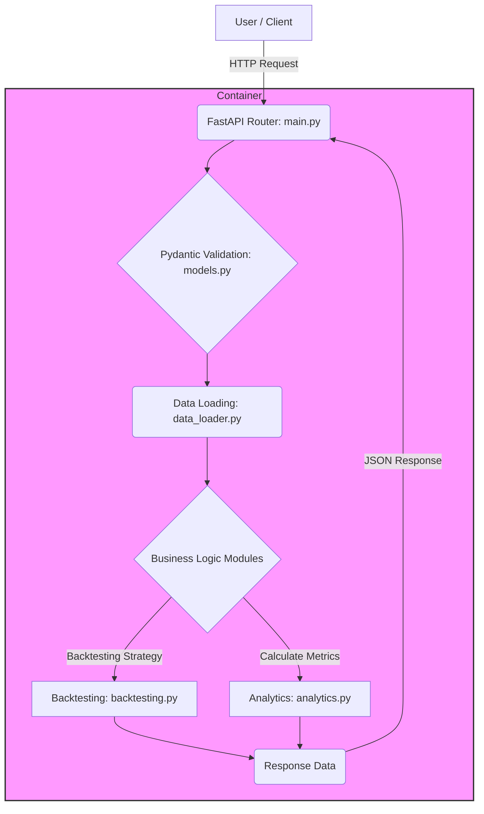

# Market Data Analyzer API

## 1\. 🎯 Problem Statement

The goal of the **Market Data Analyzer** is to provide a fast, containerized, and easily accessible API for retrieving, analyzing, and backtesting financial market data. It addresses the challenge of rapidly testing trading hypotheses and generating key financial metrics without requiring direct access to underlying data providers or complex local setups.


## 2\. 🧱 Architecture Diagram

The application follows a modular, three-tier architecture, encapsulated within a single Docker container for ease of deployment.



-----

## 3\. ⚙️ Tech Used

This project is built using the following core technologies:

| Category | Technology | Purpose |
| :--- | :--- | :--- |
| **Framework** | **FastAPI** | High-performance API foundation. |
| **Data Models** | **Pydantic** | Data validation and serialization. |
| **Data Acquisition** | **`yfinance`** | Free access to Yahoo Finance market data. |
| **Containerization** | **Docker** | Packaging the application for consistent deployment. |
| **Analysis** | **Pandas, NumPy** | Core libraries for data manipulation and calculation. |

-----

## 4\. 🚀 How to Run with Docker

The easiest way to get the Market Data Analyzer running is by using Docker.

### Prerequisites

  * Docker Desktop or Docker Engine installed.

### Steps

1.  **Clone the Repository (If applicable) or navigate to the project root:**

    ```bash
    cd project_root/Market Data Analyzer
    ```

2.  **Build the Docker Image:**
    This command reads the instructions from the `Dockerfile` and creates an image named `market-analyzer`.

    ```bash
    docker build -t market-analyzer .
    ```

3.  **Run the Container:**
    This command starts the container, mapping port `8000` inside the container to port `8000` on your host machine.

    ```bash
    docker run -d --name market_data_app -p 8000:8000 market-analyzer
    ```

4.  **Access the API Documentation:**
    Once the container is running, you can access the interactive Swagger UI documentation:

      * **Swagger UI:** `http://localhost:8000/docs`
      * **ReDoc:** `http://localhost:8000/redoc`

-----

## 5\. 💻 API Endpoints

The core functionality of the application is exposed through the following FastAPI endpoints:

| Endpoint | HTTP Method | Description | Request Body Example (Pydantic Model) |
| :--- | :--- | :--- | :--- |
| `/api/v1/data/{ticker}` | `GET` | Retrieve raw historical data for a given stock ticker. | (Query Params: `start_date`, `end_date`) |
| `/api/v1/analytics/sma` | `POST` | Calculate Simple Moving Average (SMA) for a ticker over specified periods. | `{ "ticker": "TSLA", "periods": [20, 50], "start_date": "2024-01-01" }` |
| `/api/v1/backtest/strategy` | `POST` | Execute a simple backtest based on user-defined trading rules (e.g., cross-over). | (Requires detailed strategy definition in body) |
| `/` | `GET` | Root health check endpoint. | None |

*(Note: The exact structure of the POST request bodies is defined in `models.py`.)*

-----

## 6\. 📊 Screenshots of Charts

### Moving Average Crossover Example

>

> **Description:** Visualization of a simulated SMA crossover strategy over a 6-month period, demonstrating signals generated by `analytics.py`.

### Backtest Performance Summary

>

> **Description:** Summary metrics generated by `backtesting.py` showcasing the overall performance of a tested strategy.
